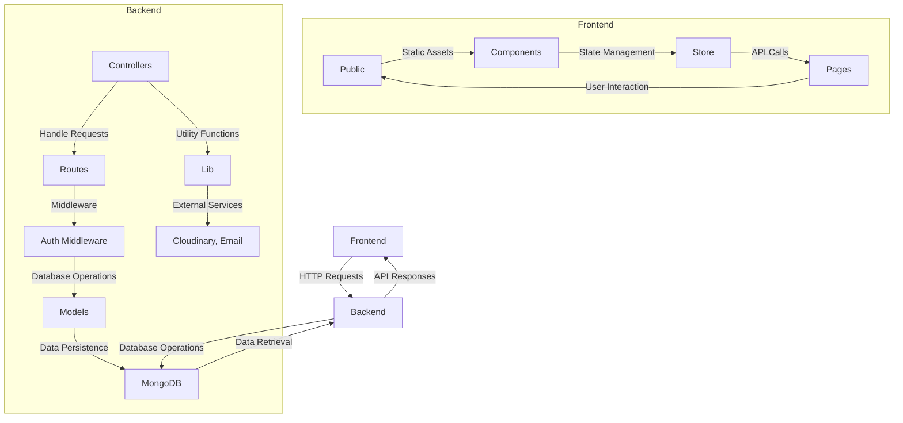

```mermaid
graph TD
    A[Frontend] -->|HTTP Requests| B[Backend]
    B -->|Database Operations| C[MongoDB]
    C -->|Data Retrieval| B
    B -->|API Responses| A

    subgraph Frontend
        A1[Public] -->|Static Assets| A2[Components]
        A2 -->|State Management| A3[Store]
        A3 -->|API Calls| A4[Pages]
        A4 -->|User Interaction| A1
    end

    subgraph Backend
        B1[Controllers] -->|Handle Requests| B2[Routes]
        B2 -->|Middleware| B3[Auth Middleware]
        B3 -->|Database Operations| B4[Models]
        B4 -->|Data Persistence| C
        B1 -->|Utility Functions| B5[Lib]
        B5 -->|External Services| B6[Cloudinary, Email]
    end
```
