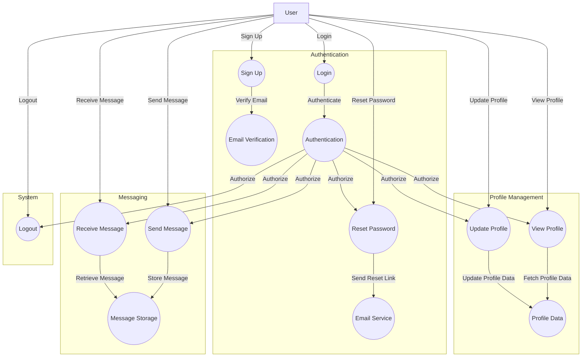

```mermaid
graph TD
    A[User] -->|Sign Up| B((Sign Up))
    A -->|Login| C((Login))
    A -->|Send Message| D((Send Message))
    A -->|Receive Message| E((Receive Message))
    A -->|View Profile| F((View Profile))
    A -->|Update Profile| G((Update Profile))
    A -->|Reset Password| H((Reset Password))
    A -->|Logout| I((Logout))

    subgraph Authentication
        B -->|Verify Email| J((Email Verification))
        C -->|Authenticate| K((Authentication))
        H -->|Send Reset Link| L((Email Service))
    end

    subgraph Messaging
        D -->|Store Message| M((Message Storage))
        E -->|Retrieve Message| M
    end

    subgraph Profile Management
        F -->|Fetch Profile Data| N((Profile Data))
        G -->|Update Profile Data| N
    end

    subgraph System
        K -->|Authorize| D
        K -->|Authorize| E
        K -->|Authorize| F
        K -->|Authorize| G
        K -->|Authorize| H
        K -->|Authorize| I
    end
```
